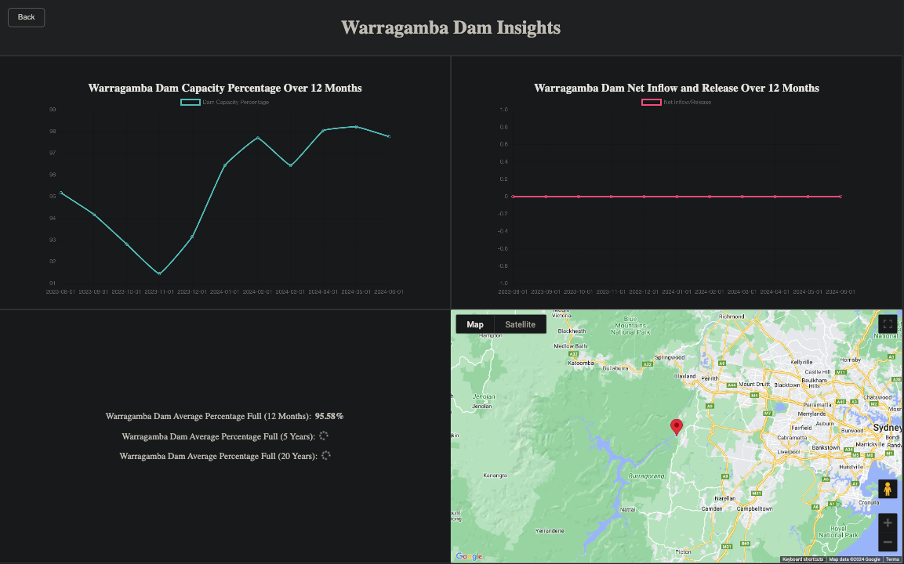
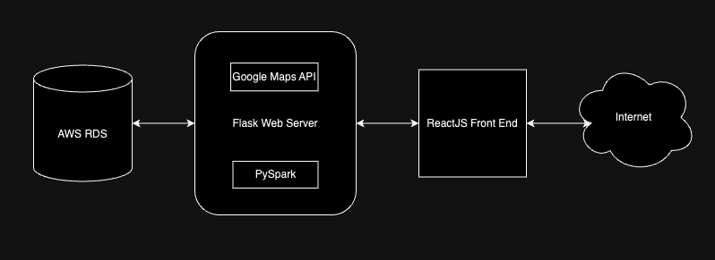
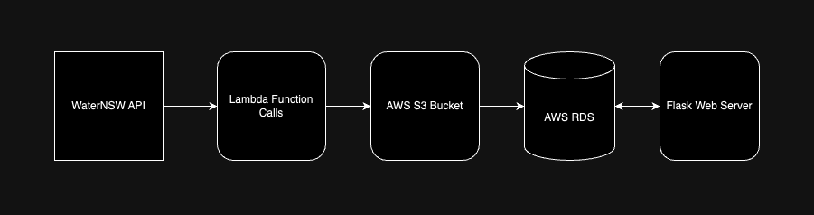

# Sydney Dam Monitoring - Live Data Collection & Analysis

## Project Overview
A data dashboard application that collects and analyzes real-time data about dams in NSW. Created with a Flask API, TypeScript React, PySpark, AWS RDS, S3, Lambda, and Docker.

## Screenshot

## Table of Contents

- [Frontend](#frontend)
- [Backend](#backend)
- [Data Approach](#data)
- [General](#general)

# Project Links

- [Backend for Sydney Dam Monitoring](https://github.com/cyberforge1/backend-sydney-dam-monitoring)

- [Frontend for Sydney Dam Monitoring](https://github.com/cyberforge1/frontend-sydney-dam-monitoring)

- [AWS RDS for Sydney Dam Monitoring](https://github.com/cyberforge1/aws-rds-sydney-dam-monitoring)

- [AWS Data Engineering](https://github.com/cyberforge1/aws-data-engineering)

- [AWS Glue for Sydney Dam Monitoring](https://github.com/cyberforge1/aws-glue-sydney-dam-monitoring)

## Goals & MVP

- This project aims to support water management efforts and enhance public awareness about water resource trends and statuses.

- The MVP was to collect live and historic data about dams in NSW, using the WaterNSW API and display this in a responsive data dashboard to the user. 

- One major focus was to integrate cloud and data tools to create a live data pipeline directly from the public API into an AWS RDS, which could then be cleaned, processed and analyzed with PySpark.

## Build Strategy

- **First Stage** - Python scripting to collect all available data from the WaterNSW API, process it with Pandas, and then seed it into a local MySQL database.

- **Second Stage** - Building a Flask API on top of the local database, then connecting a React UI to display the data in various ways, including graphically with the Chart.js package

- **Third Stage** - Attaching PySpark to the database to create data-driven endpoints that could perform live analysis on the entire dataset to provide historical insights

- **Fourth Stage** - Creating a live data pipeline with AWS Services and connecting this live-update database with the Flask backend, to create a real-time data experience

# Frontend - React Typescript

## Tech Stack

- React 
- Chart.js
- Typescript

## Design Goals
- This frontend was designed primarily as an SPA, with additional search functionality to fetch pages about specific resources. 
- Designed with the objective of creating an aesthetically appealing and interactive interface to display useful data for an engaging UX experience. 

## How To Use
- Use the search functionality with the search bar or open a list to find specific insights on a dam. 
- Clicking the 'dam-group' button will allow for automatic population of a new grouping and re-render the associated graph. 
- A variety of graphs and statistics display useful information to the user.

## Project Features
- [x] Chart.js integrated to provide graphical insights
- [x] Search feature allowing users to find specific dams
- [x] Individual pages about each dam that provide specific insights and analysis
- [x] Google Maps API integration for dynamically displaying location 

# Backend - Flask API

## Tech Stack

- Flask
- Python
- PySpark

## Design Goals
- The aim of this application was to create a lightweight Flask API, that can easily switch between databases, and integrate Python data tools for quick and efficient analysis of the underlying dataset. 

## How To Use
- The frontend app provides a user interface to interact with the backend automatically; endpoints can also be accessed and tested through applications like Postman or curl.

## Project Features
- [x] PySpark for data cleaning, processing and analysis
- [x] A collection of data-driven endpoints 
- [x] A simple and lightweight API to access the dataset

# Data - Collection, Storage & Analysis

## Project Diagram

## Tech Stack

- Pandas
- PySpark
- WaterNSW API 
- AWS RDS
- AWS S3 bucket
- AWS Lambda

## Data Components

There are three major data components in this project:

### Collection 

- A series of Python scripts were written to collect all data from the WaterNSW API and automate the database seeding process. These files can be found in the database-prep folder.

### PySpark Analysis

- PySpark was attached to the local database during development to perform a series of real-time calculations on the dataset, accessible through endpoints in the Flask API. 

- The analysis focuses specifically about how the average water level of any specific dam or the aggregation of dams within the dataset have changed over set time periods (12 months, 5 years, and 20 years).

### Live Data Pipeline 

- The WaterNSW API provides new data about each dam in the dataset on the first day of each month.

- A live data pipeline was created by first creating an AWS Lambda function call to collect an OAuth2 key, with a 12-hour duration, from the WaterNSW API on the first of each month and store this in an AWS S3 Bucket. 

- A second Lambda function call then uses this key to make an API call that accesses the endpoint that provides the latest data for each dam. This recent data is then stored in the AWS S3 Bucket. 

- This recent data is then written into the historical and latest data tables in the associated AWS RDS to provide an access point to the Flask API.

## AWS Pipeline Diagram

## Project Features
- [x] AWS Lambda, AWS S3 Bucket and AWS RDS to create a live data pipeline 
- [x] Pandas for data handling and transfer
- [x] Live data cleaning, processing and analysis with PySpark
- [x] Scripting for API data collection and database seeding 

## Deployment - Docker, AWS ECS, Fargate

- Deployed by using Docker by tagging images in the AWS ECR, and then creating a service in AWS ECS 
- This project uses AWS Fargate to spin up a serverless compute engine when the deployment URL is accessed.

# General

## Additions & Improvements
- [ ] Investigate cached storage for calculations each month
- [ ] Fix bug with dynamically updating months on graphs
- [ ] Fix bug with button click in 'Dam Capacity Percentage Over Last 12 Months' graph
- [ ] Create testing for frontend and backend 
- [ ] Providing more complex analysis with PySpark (time-series, seasonal trends, etc.)
- [ ] Addition of distributed computing for data processing with Spark

## Learning Highlights
- Building a cloud-based live update data pipeline
- Integrating new data tools such as Pandas and PySpark
- Gaining hands-on experience with various AWS services 
- Creating a React based data dashboard to display insights to users
- Deploying with Docker and serverless computing resources

## Challenges
Many aspects of this application were challenging and provided experience in new domains, including creating a live-data pipeline, deployment with Docker, and learning new data tools.

## Contact Me
- Visit my [LinkedIn](https://www.linkedin.com/in/obj809/) for more details.
- Check out my [GitHub](https://github.com/cyberforge1) for more projects.
- Or send me an email at obj809@gmail.com
 
Thanks for your interest in this project. Feel free to reach out with any thoughts or questions.
 
 
Oliver Jenkins © 2024
